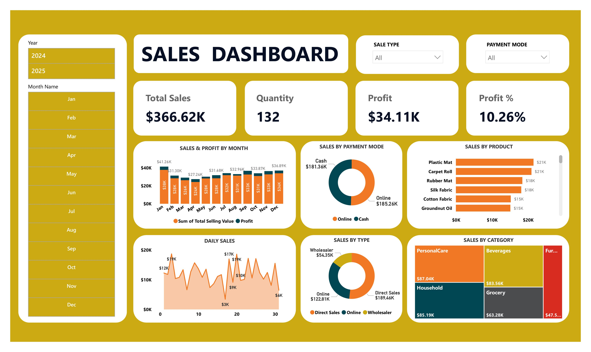

## Sales Dashboard

A modern and interactive Sales Dashboard built in **Power BI** to analyze sales performance, profitability, customer purchasing behavior, and product trends.

### Key Features
- 📈 Track Total Sales, Profit, Quantity Sold, and Profit Percentage
- 📅 Filter data by Year and Month
- 💳 Analyze sales by Payment Mode (Cash & Online)
- 🏷️ Compare sales performance across Product Categories
- 📦 Identify top-selling products
- 📊 Monitor monthly and daily sales trends
- 🔍 Interactive slicers for dynamic data exploration

### Dashboard Preview

### Insights Provided
- Monthly sales and profit performance
- Product-wise sales comparison
- Category-wise revenue contribution
- Payment mode distribution
- Sales type analysis (Direct Sales, Online, Wholesaler)
- Daily sales trend monitoring

### Tools Used
- Power BI
- Power Query
- DAX
- Data Visualization & Analytics

### Skills Demonstrated
`Data Analysis` • `Business Intelligence` • `Power BI` • `Dashboard Design` • `Data Visualization` • `DAX` • `Data Modeling`
